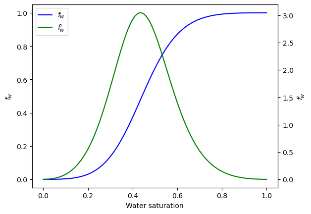
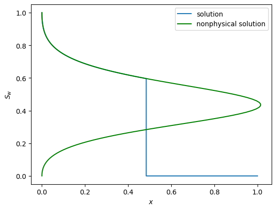

<!--
title:   多孔質媒体内における流体の流れの理論（二相の場合）
tags:    数値計算,水理学,貯留層工学
id:      7e135cd2fdf409a94f56
private: false
-->
# はじめに

貯留層工学の理論に関する記事の第2回は二相流れについてです。

第1回の単相流れは下記を参照してください。

https://qiita.com/shohirose/items/e80f02023e4926bb7ebb

# 二相流

## 質量保存則

孔隙内が油と水の2相で満たされている場合を考えます。各相が孔隙に占める割合を飽和率と呼び、次式で定義します。

$$
S_\alpha := \frac{V _ {\alpha}}{V _ p}
$$

ここで$V_p$は孔隙体積、$V _ \alpha$は$\alpha$相の体積です。
各相は一様な組成で、かつ各相間で成分交換がおきないと仮定すると、各相の質量保存則は次式で表されます。

$$
\frac{\partial}{\partial t} (\rho _ \alpha S _ \alpha \phi) + \nabla \cdot (\rho _ \alpha \mathbf{u} _ \alpha) + \tilde{m} _ \alpha = 0 \tag{1}
$$

ここで$\rho _ \alpha$は$\alpha$相の密度、$\phi$は孔隙率、$\mathbf{u} _ \alpha$は$\alpha$相の流速、$\tilde{m} _ \alpha$は$\alpha$相の吸い込み強さを表します。各相の容積係数

$$
B_\alpha := \frac{V _ \alpha}{V_{\alpha,sc}} = \frac{\rho_{\alpha, sc}}{\rho _ \alpha}
$$

を用いると

$$
\frac{\partial}{\partial t} \left( \frac{\phi S _ \alpha}{B _ \alpha} \right) + \nabla \cdot \left( \frac{1}{B _ \alpha} \mathbf{u} _ \alpha \right) + \tilde{q}_{\alpha} = 0 \tag{2}
$$

と表せます。ここで$\rho _ {\alpha, sc}$は基準状態における$\alpha$相の密度、$\tilde{q} _ {\alpha} := \tilde{m} _ {\alpha}/\rho _ {\alpha, sc}$です。

## Darcy則

多相流れの流束と圧力勾配の関係を表すDarcy則は次式で表されます。

$$
\mathbf{u} _ \alpha = - \frac{k k_{r \alpha}}{\mu _ \alpha} \left( \nabla p _ \alpha - \gamma _ \alpha \nabla z \right) \tag{3}
$$

ここで$k$は絶対浸透率、$k _ {r\alpha}$は$\alpha$相の相対浸透率、$\mu _ \alpha$は$\alpha$相の粘度、$g$は重力加速度、$\gamma _ \alpha = \rho _ \alpha g$です。

一般的に相対浸透率は飽和率の関数で、岩石ごとに異なり、実験により測定されます。一般的に用いられる相対浸透率モデルは次式で表されるBrooks-Corey modelです。

```math
k _ {ro} = k _ {romax} \left( \frac{S_o - S_{or}}{1 - S_{or} - S_{wc}} \right)^{n _ o} \\
k _ {rw} = k _ {rwmax} \left( \frac{S_w - S_{wc}}{1 - S_{or} - S_{wc}} \right)^{n _ w}
```

ここで$S _ {wc}$は不動水飽和率、$S _ {or}$は残留油飽和率、$k_{r\alpha max} \in [0, 1]$であり、また$n_\alpha$は一般的に1～6の間を取ります。

## 毛細管圧力

岩石のような多孔質媒体内に2つ以上の相が存在する場合、界面張力によって相の間に圧力差が生じます。岩石内における2相間の圧力差を毛細管圧力と呼び、次式で定義します。

$$
p _ c := p _ {nw} - p _ w
$$

ここで$p _ c$は毛細管圧力、$p _ {nw}$は非濡れ相の圧力、$p _ w$は濡れ相の圧力です。たとえば、ガス・油・水が存在する場合の毛細管圧力は

```math
\begin{align}
p _ {cow} &= p _ o - p _ w \\
p _ {cgo} &= p _ g - p _ o
\end{align}
\tag{4}
```

となります。ここで下付き文字の$o$は油相、$w$は水相、$g$はガス相を表します。

毛細管圧力は飽和率の関数であり、岩石によって異なり、実験で測定されます。よく用いられる毛細管圧力モデルはBrooks-Coreyモデルです。

$$
p _ {cwo} = p _ t \left( \frac{1 - S _ {wc}}{S _ {w} - S _ {wc}} \right)^{\frac{1}{\lambda}}
$$

ここで$p _ t$はthreshold pressureで、$\lambda$は孔隙径分布を表すパラメータです。

## 基礎方程式

油と水の2相が存在する場合の基礎方程式は、式(3)、(4)を(2)に代入して

```math
\begin{align}
\nabla \cdot \left[ \lambda_o ( \nabla p_o - \gamma_o \nabla z ) \right] &= \frac{\partial}{\partial t} \left[ \frac{\phi S_o}{B_o} \right] + \tilde{q}_{o} \tag{5} \\
\nabla \cdot \left[ \lambda_w ( \nabla p_w - \gamma_w \nabla z ) \right] &= \frac{\partial}{\partial t} \left[ \frac{\phi S_w}{B_w} \right] + \tilde{q}_{w} \tag{6}
\end{align}
```

となります。ここで$\lambda _ \alpha$は相の易動度で次式で定義されます。

$$
\lambda _ \alpha = \frac{k k _ {r\alpha}}{\mu _ \alpha B _ \alpha}
$$


## Fractional Flow Equation

非圧縮性流体の場合、$B _ \alpha = 1$なので

```math
\begin{align}
-\nabla \cdot \mathbf{u}_o &= \frac{\partial}{\partial t} \left( \phi S_o \right) + \tilde{q}_o \tag{7} \\
-\nabla \cdot \mathbf{u}_w &= \frac{\partial}{\partial t} \left( \phi S_w \right) + \tilde{q}_w \tag{8}
\end{align}
```

となります。孔隙率を一定と仮定し、$\tilde{q} _ T := \tilde{q} _ w + \tilde{q} _ o$とすると、式(7)(8)および$S _ w + S _ o = 1$より総速度$\mathbf{u}_T := \mathbf{u}_o + \mathbf{u}_w$に関する式が得られます。

```math
\begin{align}
\nabla \cdot \mathbf{u}_T
 &= \nabla \cdot (\mathbf{u}_o + \mathbf{u}_w ) \\
 &= - \tilde{q}_{o} - \tilde{q}_{w} - \phi \frac{\partial}{\partial t} \left( S_o + S_w \right) \\
 &= - \tilde{q} _ T \tag{9}
\end{align}
```


油相と水相の流束に関するDarcy則

```math
\mathbf{u}_w = -\lambda_w (\nabla p_w - \gamma_w \nabla z) \\
\mathbf{u}_o = -\lambda_o (\nabla p_o - \gamma_o \nabla z)
```

から各相の圧力を消去すると次式を得ます。

$$
\mathbf{u} _ w = M \mathbf{u} _ o + \lambda_w (\nabla p _ c + \Delta \gamma \nabla z)
$$

ここで$M = \lambda_w / \lambda_o$は易動度比(mobility ratio)、$\Delta \gamma = \gamma_w - \gamma_o$です。$\mathbf{u}_w = \mathbf{u}_T - \mathbf{u}_o$を代入してfractional flow equationを得ます。

```math
\begin{align}
\mathbf{u} _ o &= f_o \mathbf{u} _ T - \bar{\lambda} (\nabla p_c + \Delta \gamma \nabla z) \tag{10} \\
\mathbf{u} _ w &= f_w \mathbf{u} _ T + \bar{\lambda} (\nabla p_c + \Delta \gamma \nabla z) \tag{11}
\end{align}
```

ここで$f_\alpha$は$\alpha$相のfractional flow coefficient、$\bar{\lambda}$は平均易動度です。

```math
f_o := \frac{\lambda _ o}{\lambda _ w + \lambda _ o} \\
f_w := \frac{\lambda _ w}{\lambda _ w + \lambda _ o} \\
\bar{\lambda} := \frac{\lambda _ o \lambda _ w}{\lambda _ w + \lambda _ o} \\
```

粘度を一定と仮定すると、相対浸透率は飽和率の関数のため、$f _ \alpha$も$\lambda$も飽和率の関数となります。
式(10)を(7)に代入して次式を得ます。

```math
\nabla \cdot \left[ f_o \mathbf{u} _ T - \bar{\lambda} (\nabla p_c + \Delta \gamma \nabla z) \right] 
= \phi \frac{\partial S_w}{\partial t} - \tilde{q}_o \tag{12}
```

式(12)の左辺第1項において、$f_o=f_o(S_w)$かつ式(9)より次のように書き換えられます。

```math
\begin{align}
\nabla \cdot (f_o \mathbf{u}_T) &= \mathbf{u}_T \cdot \nabla f_o  + f_o \nabla \cdot \mathbf{u}_T \\
&= \frac{d f_o}{d S_w} \mathbf{u}_T \cdot \nabla S_w - f_o \tilde{q}_T \\
&= -\frac{d f_w}{d S_w} \mathbf{u}_T \cdot \nabla S_w - (1 - f_w) \tilde{q}_T \qquad (\because f_o + f_w = 1) \tag{13}
\end{align}
```

また$\bar{\lambda}=\bar{\lambda}(S_w)$より第2項と第3項は次のように書き換えられます。

```math
\begin{align}
\bar{\lambda} \nabla p_c
 &= \bar{\lambda} \frac{dp_c}{dS_w} \nabla S_w  \tag{14} \\
\nabla \cdot (\bar{\lambda} \Delta \gamma_{ow} \nabla z )
 &=  \Delta \gamma \nabla z \cdot \frac{d\bar{\lambda}}{dS_w} \nabla S_w \tag{15}
\end{align}
```

式(13)~(15)を式(12)に代入して次式を得ます。

```math
-\nabla \cdot \left[ \bar{\lambda} \frac{dp_c}{dS_w} \nabla S_w \right] - \left[ \mathbf{u}_T \frac{d f_w}{d S_w} + \frac{d\bar{\lambda}}{dS_w} \Delta \gamma \nabla z \right] \cdot \nabla S_w = \phi \frac{\partial S_w}{\partial t} + \tilde{q}_w - f_w \tilde{q}_T \tag{16}
```

## Buckley-Leverett Equation

毛細管圧力、重力項、および吸い込みを無視すると、式(16)は次式のように簡略化されます。

$$
\frac{\partial S _ w}{\partial t} + \frac{\mathbf{u} _ T}{\phi} \frac{d f _ w}{d S _ w} \nabla S_w = 0 \tag{17}
$$

これは水飽和率に関する移流方程式です。1次元において式(17)は

$$
\frac{\partial S _ w}{\partial t} + \frac{u _ T}{\phi} \frac{d f _ w}{d S _ w} \frac{\partial S _ w}{\partial x} = 0 \tag{18}
$$

となります。

式(18)を初期条件$S _ w = \varphi(x)$の下で解くことを考えます。1次元における水飽和率の全微分

$$
dS_w = \frac{\partial S_w}{\partial x} dx + \frac{\partial S_w}{\partial t} dt
$$

において、飽和率一定の場合を考えると

$$
\frac{\partial S _ w}{\partial t} = - \frac{\partial S _ w}{\partial x}  \frac{dx}{dt} \biggr| _ {S _ w} \tag{19}
$$

となります。式(19)を式(18)に代入し、Buckley-Leverett equationを得ます。

$$
v_{S_w} := \frac{dx}{dt} \biggr| _ {S _ w} = \frac{u _ T}{\phi} \frac{d f_w}{d S_w} \tag{20}
$$

式(20)は、飽和率一定の位置の移動速度がfractional flow coefficientの微分値で決まることを表しています。

Brooks-Coreyモデルにおいて、$n_w=3$、$n_o=3$、$k_{rwmax}=0.2$、$k_{romax}=1$、$\mu_w=1$、$\mu_o=10$としたときのfractional flow equationとその微分値を下図に示します。



このfractional flow equationを用いると、初期条件

```math
\varphi(x) =
\begin{cases}
1 & x \leq 0 \\
0 & x > 0
\end{cases}
\tag{21}
```

の下での解は、式(20)より、下図のnonphysical solutionのようなある$x$において複数の$S_w$が存在するような非物理的な解になります。



このように非物理的な解が導かれたのは、元の式(18)がBurgers equationのように衝撃波を生じて解が不連続になる性質をもつことを考慮していなかったからです。本当の解は上図のsolutionの線です。

初期条件$\varphi(x)$における式(18)の一般解は、特性曲線法を用いて$S_w = \varphi(x - v_{S_w}t)$と導かれます。このとき、曲線$x = \xi(t)$に沿って不連続となるのは、Rankine-Hugoniot条件が満たされる場合です。

$$
\frac{F(S _ w^-) - F(S _ w^+)}{S _ w^- - S _ w^+} = \xi'(t) = \sigma, \qquad F(S_w) := \frac{u_T}{\phi} f_w (S_w) \tag{22}
$$

ここで$S _ w^- (x,t)$は不連続曲線の左側からの極限、$S _ w^+ (x,t)$は不連続曲線の右側からの極限を表します。上式はfractional flow equation上の2点間の傾きを表します。

また非物理的な解を避けるために、エントロピー条件を満たす不連続解のみを採用します。

$$
F'(S _ w^-) > \sigma > F'(S _ w^+) \tag{23}
$$

$F \propto f_w$より、上式はfractional flow equation上の2点を結んだ直線の傾きが、不連続曲線の右側での$f_w'$よりも大きく、左側の$f_w'$よりも小さいことを表しています。

初期条件(21)のもとで、不連続曲線の右側が$S _ w^+=0$であると仮定すると、Rankine-Hugoniot条件とエントロピー条件の両方を満たす$S _ w^-$は、下図のように$f_w$と$S_w=0$からの直線が接する点であることがわかります。この節点の飽和率$S _ {wf}$が不連続曲線の右側の飽和率であり、不連続曲線のことをshock frontと呼びます。


Shock frontの左側は連続なので、式(18)またはBuckley-Reverett equationに従って飽和率が計算されます。よって最終的に式(18)の解は下図のsolutionの線となります。

